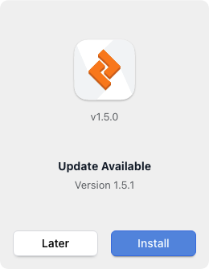
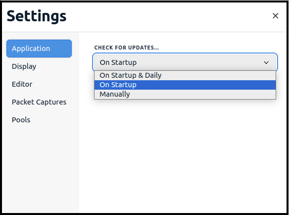

# Installation

Zui is an interactive desktop application for Windows, macOS, and Linux.
To install, click the link at the
[Zui download](https://www.brimdata.io/download/) page for your platform
and double-click the downloaded package to launch the installer.

The notes and short videos below show how to successfully install on each
platform.

   * [Windows Installation](#windows-installation)
   * [macOS Installation](#macos-installation)
   * [Linux Installation](#linux-installation)

Once installed, no additional configuration is necessary. For your reference,
a separate article describes the [filesystem paths](./support/Filesystem-Paths.md) where unpacked Zui
binaries and saved user data are stored on each platform.

Zui checks over the network for newer releases that may be available for
[update](#updates).

If you run into any problems, you may want to browse the 
[troubleshooting docs](./support/Troubleshooting.md). If you get stuck, [join our public Slack](https://www.brimdata.io/join-slack/)
and we'll be happy to help.

## Windows Installation

* Download the Zui installer via the **Windows** link at the [Zui download](https://www.brimdata.io/download/) page
* Launch the downloaded `.exe` file to begin installation
   * Respond to a Microsoft Defender SmartScreen warning, if shown ([learn more](./support/Troubleshooting.md#microsoft-defender-smartscreen-has-flagged-the-zui-installer-as-an-unrecognized-app))
* Choose between installing for only the current user (default) or a machine-wide install
* Click **Finish** and Zui will launch when installation completes
* Click the Zui icon on the Desktop or Start menu to relaunch in the future
* Zui checks over the network for newer releases that may be available for [update](#updates)

## macOS Installation

* Download the Zui installer via the **macOS** link at the [Zui download](https://www.brimdata.io/download/) page
* Launch the downloaded `.dmg` file to begin installation
* Click and drag the Zui icon into the Applications folder
* Click the Zui icon in the Applications folder to start Zui now and in the future
* You may need to click through an "Are you sure?" prompt the first time Zui is launched
* Zui checks over the network for newer releases that may be available for [update](#updates)

## Linux Installation

* Uninstall any currently-installed Zui release, using a tool like `yum`,
   `dnf`, or `apt` (saved data and settings will not be disturbed by uninstall,
   as these are stored under a
   [user data](./support/Filesystem-Paths.md#user-data)
   path that's separate from the
   [application binaries](support/./Filesystem-Paths.md#application-binaries))
* Download either the **Ubuntu/Debian** (`.deb`) or **Red Hat/Fedora** (`.rpm`) installer at the
  [Zui download](https://www.brimdata.io/download/) page, as appropriate
  for your Linux distribution
* Open the downloaded `.deb` or `.rpm` file in the Software Install utility and click **Install**
* Enter administration credentials, if prompted
* Click the Zui icon in the applications menu to start the app now and in the future
* Zui checks over the network for newer releases that may be available for [update](#updates)

## Updates

In a default configuration, each time Zui is launched it will check over the
network for the availability of a newer release. If one is found, a
notification like the following will pop up.

If **Later** is clicked, the notification is dismissed and no update is
performed. If **Install** is clicked, the result on each platform is as follows:

|**Platform**|**Result**|
|-|-|
|**Windows**|An interactive wizard for the newer release will launch, just like the one from initial [installation](#windows-installation).|
|**macOS**|The newer release will install in the background and Zui will automatically relaunch into the newer version.|
|**Linux**|The [Zui download](https://www.brimdata.io/download/) page will open in your browser. Manual uninstall/reinstall is necessary on Linux, so repeat the same download/uninstall/reinstall steps as during initial [installation](#linux-installation).|

In all cases, updating to a newer version of the app will preserve your existing
[user data](./support/Filesystem-Paths.md#user-data). Because the way user data
is stored can sometimes change in newer releases, downgrading to older releases is
_not_ currently supported.

Configurable **Settings** are available to change notification frequency.

|**Setting**|**Result**|
|-|-|
|**On Startup** (default)|A check is performed for a newer release once each time Zui is launched|
|**On Startup & Daily**|A check is performed for a newer release when Zui is launched and every 24 hours thereafter that the app remains open|
|**Manually**|Zui will never pop up an automatic notification about a newer release|

Regardless of settings, manually clicking the pull-down menu option
**Help > Check for Updates** on Windows/Linux or **Zui > Check for Updates**
on macOS will perform an immediate check and a notification will pop up if a newer
release is detected.
